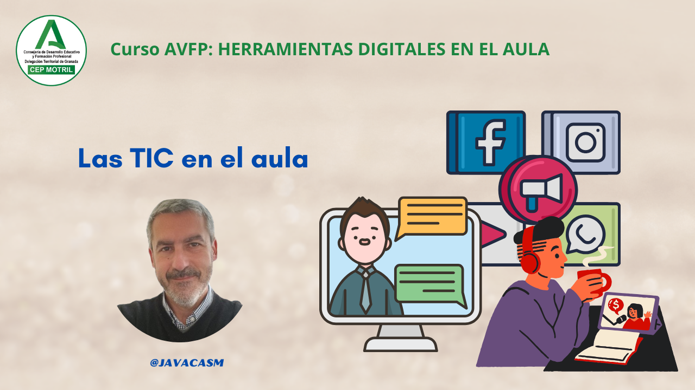

## Las TIC en el aula

[Vídeo: Las TIC en el aula](https://drive.google.com/file/d/1mvYCjRCKLdXdk7CVUwwTZem-cp6x9h8B/view?usp=sharing)

Las Tecnologías de la Información y la Comunicación (TIC) ofrecen numerosas ventajas en el ámbito educativo, alineadas con diversas competencias clave para el desarrollo integral de los estudiantes. Veamos algunas de estas ventajas:

1. **Competencia Digital:** El uso de las TIC en la educación permite a los estudiantes desarrollar habilidades digitales fundamentales, como la capacidad de buscar, evaluar, seleccionar y utilizar información de manera efectiva y ética en entornos digitales.

2. **Aprendizaje Activo y Autónomo:** Las TIC ofrecen herramientas interactivas y recursos multimedia que fomentan la participación activa de los estudiantes en su propio proceso de aprendizaje, promoviendo la autonomía y la autorregulación.

3. **Competencia en Resolución de Problemas:** Las TIC proporcionan entornos de simulación y herramientas de resolución de problemas que permiten a los estudiantes enfrentarse a situaciones complejas, experimentar con soluciones y aprender de sus errores de manera segura.

4. **Colaboración y Trabajo en Equipo:** Las plataformas y herramientas en línea facilitan la colaboración entre estudiantes, promoviendo el trabajo en equipo, la comunicación efectiva, la negociación de roles y la resolución de conflictos de manera colaborativa.

5. **Competencia Lingüística y Comunicativa:** El uso de las TIC en actividades de lectura, escritura y expresión oral en diferentes formatos (texto, audio, video) contribuye al desarrollo de la competencia lingüística y comunicativa de los estudiantes, así como a su capacidad de adaptarse a diferentes contextos comunicativos.

6. **Creatividad e Innovación:** Las TIC ofrecen herramientas para la creación de contenido multimedia, la programación, la edición de video, entre otras, que estimulan la creatividad y la innovación, permitiendo a los estudiantes expresar sus ideas de manera original y desarrollar soluciones creativas a problemas complejos.

7. **Pensamiento Crítico:** El acceso a una amplia gama de recursos en línea brinda oportunidades para analizar, evaluar y cuestionar la información de manera crítica, desarrollando la capacidad de pensar de forma reflexiva y tomar decisiones informadas.

8. **Competencia Intercultural y Global:** Las TIC facilitan la comunicación y colaboración con personas de diferentes culturas y contextos, promoviendo la apreciación de la diversidad cultural y el desarrollo de una mentalidad global.

En resumen, el uso de las TIC en la educación ofrece múltiples ventajas que van más allá del mero acceso a la tecnología, promoviendo el desarrollo de competencias clave para el éxito personal, académico y profesional de los estudiantes en la sociedad actual.

### Herramientas TIC

Veamos algunas de las herramientas TIC que tenemos disponibles, hay muchas más...

1. **Competencia Digital:**
   - Plataformas de aprendizaje en línea como Moodle, Canvas o Google Classroom para la gestión de contenidos y actividades.
   - Herramientas de búsqueda y evaluación de información como Google Scholar, Scopus o bibliotecas digitales especializadas.
   - Software de edición de documentos como Microsoft Word, Google Docs o LaTeX para la creación y colaboración en textos escritos.

2. **Aprendizaje Activo y Autónomo:**
   - Plataformas de microaprendizaje como Khan Academy, Coursera o Udemy que ofrecen cursos cortos y recursos interactivos.
   - Aplicaciones de organización y planificación como Trello, Asana o Google Calendar para gestionar el tiempo y establecer metas de aprendizaje.
   - Herramientas de gamificación como Kahoot, Quizizz o Classcraft para motivar la participación y el compromiso con el aprendizaje.

3. **Competencia en Resolución de Problemas:**
   - Entornos de programación como Scratch, Code.org o Python para aprender a resolver problemas mediante la lógica computacional.
   - Simuladores virtuales en ciencias y matemáticas como PhET, GeoGebra o Desmos para experimentar y explorar conceptos de manera práctica.
   - Plataformas de resolución de problemas colaborativas como GitHub, Stack Overflow o Reddit donde los estudiantes pueden plantear y resolver dudas con la comunidad.

4. **Colaboración y Trabajo en Equipo:**
   - Herramientas de videoconferencia como Zoom, Google Meet o Microsoft Teams para reuniones virtuales y trabajo en grupo.
   - Plataformas de colaboración en proyectos como Google Drive, Dropbox o GitHub que permiten compartir documentos y trabajar de forma sincronizada.
   - Redes sociales educativas como Edmodo, Schoology o Padlet para fomentar la interacción y el intercambio de ideas entre estudiantes y profesores.

5. **Competencia Lingüística y Comunicativa:**
   - Herramientas de edición de video como iMovie, Adobe Premiere o Shotcut para producir contenido audiovisual y mejorar la expresión oral.
   - Plataformas de escritura colaborativa como Google Docs, Overleaf o Etherpad para trabajar en documentos escritos de manera conjunta.
   - Aplicaciones de aprendizaje de idiomas como Duolingo, Rosetta Stone o Babbel que ofrecen ejercicios interactivos y prácticas de conversación.

6. **Creatividad e Innovación:**
   - Software de diseño gráfico como Canva, Adobe Creative Cloud o Piktochart para crear presentaciones, infografías y material visual.
   - Plataformas de creación de contenido interactivo como Genially, ThingLink o H5P para desarrollar recursos multimedia y actividades didácticas.
   - Entornos de desarrollo de videojuegos como Unity, Unreal Engine o GameMaker Studio para explorar la programación y la narrativa interactiva.

Estas herramientas TIC pueden ser utilizadas de manera integrada en el proceso educativo para promover el desarrollo de competencias específicas en los estudiantes. Es importante seleccionar aquellas que mejor se adapten a los objetivos de aprendizaje y al contexto de enseñanza.