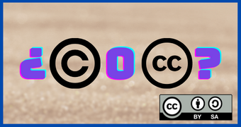

### Porqué usar Licencias libres

Utilizar licencias libres en las creaciones educativas y compartirlas puede proporcionar varios beneficios tanto para los creadores, como para la comunidad educativa en general. Aquí hay algunos argumentos a favor de usar licencias libres y compartir contenido educativo:

1. **Acceso Universal:**
   - Las licencias libres permiten un acceso universal al contenido educativo. Al compartir recursos con licencias abiertas, se elimina o reduce la barrera financiera para acceder a materiales educativos de calidad.

2. **Colaboración y Mejora Continua:**
   - Fomentar la colaboración o el compartir bajo licencias libres promueve la colaboración y la mejora continua. Otros educadores pueden construir y mejorar sobre el trabajo existente, creando así un ciclo de retroalimentación positiva.

3. **Adaptación a Contextos Locales:**
   - Las licencias libres permiten a los educadores adaptar el contenido a sus contextos locales. Pueden personalizar el material para satisfacer las necesidades específicas de sus estudiantes, reflejando mejor la diversidad y las particularidades de las aulas.

4. **Innovación Educativa:**
   - Facilita la innovación en la educación al permitir la creación y adaptación libre de recursos. Los educadores pueden experimentar con diferentes enfoques y metodologías, creando un entorno más dinámico y centrado en el estudiante.

5. **Desarrollo Profesional:**
   - Compartir recursos educativos bajo licencias libres contribuye al desarrollo profesional de los educadores. Pueden aprender unos de otros, compartir mejores prácticas y estar al tanto de las últimas tendencias en la enseñanza.

6. **Alineación con Valores Educativos:**
   - Utilizar licencias libres puede estar alineado con los valores educativos de equidad, acceso abierto y colaboración. Esto refuerza la idea de que la educación y el conocimiento deben ser accesibles para todos.

7. **Énfasis en la Participación Activa del Estudiante:**
   - La creación de recursos educativos bajo licencias libres puede fomentar la participación activa de los estudiantes. Pueden contribuir, modificar y compartir sus propios materiales, promoviendo la creatividad y la responsabilidad en el aprendizaje.

8. **Efecto Multiplicador:**
   - Al compartir bajo licencias libres, un recurso educativo puede tener un efecto multiplicador, beneficiando a un número significativo de estudiantes y educadores en todo el mundo.

9. **Preparación para el Futuro:**
   - La creación y compartición de recursos bajo licencias libres refleja la dirección hacia la que se está moviendo la educación en la era digital. Educar a los estudiantes sobre la importancia del acceso abierto y la compartición responsable es relevante para su desarrollo en la sociedad actual.

En resumen, las licencias libres y el compartir recursos educativos contribuyen a una cultura educativa abierta, colaborativa e inclusiva, promoviendo el acceso al conocimiento y la mejora continua en el campo de la educación.
