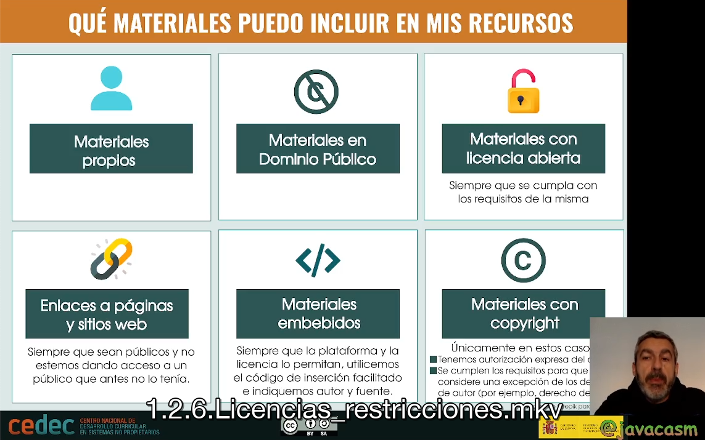
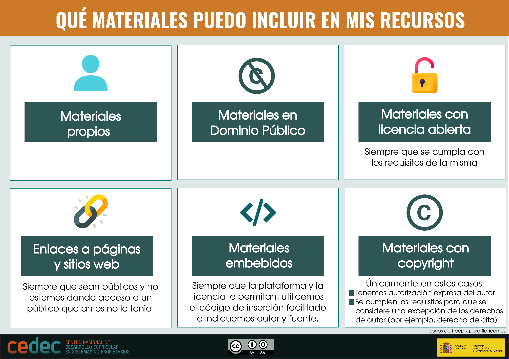
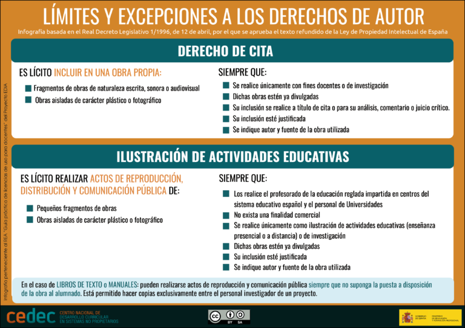

## Resumen uso de materiales

¿Qué materiales puedo incluir en mis recursos?

[Vídeo sobre qué materiales podemos utilizar y Excepciones a las licencias]((https://drive.google.com/file/d/1B34CZXqgwLnmY_qezwhlIBHOoPVDUm23/view?usp=drive_link))

Materiales que puedo usar

Excepciones a las licencias

