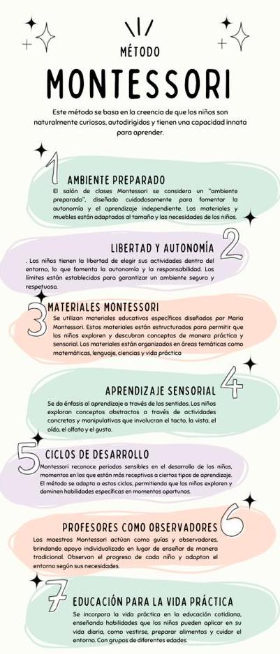

## Infografías con Canvas

### ¿Qué es una infografía?

Una infografía es una representación visual de información o datos, diseñada de manera clara y concisa para facilitar la comprensión de conceptos complejos de manera rápida y efectiva. Se caracteriza por el uso de gráficos, imágenes, iconos y texto breve para transmitir información de manera visualmente atractiva. Las infografías son herramientas visuales poderosas que permiten comunicar ideas de manera más accesible y retentiva.

**Características comunes de una infografía:**

1. **Elementos Visuales:**
   - Utiliza gráficos, iconos, imágenes y colores para representar la información de manera visualmente atractiva y fácil de entender.

2. **Texto Breve:**
   - Se caracteriza por la brevedad en el texto, utilizando frases cortas y puntos clave para transmitir la información de manera concisa.

3. **Estructura Lógica:**
   - Organiza la información de manera lógica y estructurada, guiando al lector a través de una secuencia o jerarquía clara.

4. **Enfoque en la Información Importante:**
   - Destaca los datos clave o conceptos más importantes, ayudando a los lectores a identificar y recordar la información esencial.

**Usos y propósitos de las infografías:**

1. **Síntesis de Datos:**
   - Condensan información compleja en un formato visual fácil de entender, lo que facilita la asimilación de datos.

2. **Instrucciones y Tutoriales:**
   - Proporcionan instrucciones paso a paso o tutoriales de manera visual, lo que es especialmente útil para guiar a los usuarios en procesos específicos.

3. **Presentación de Estadísticas:**
   - Resumen datos estadísticos de manera visual, permitiendo que las tendencias y patrones sean fácilmente identificables.

4. **Explicación de Conceptos:**
   - Desglosan conceptos complicados en partes más manejables, facilitando la comprensión de ideas abstractas.

5. **Marketing y Publicidad:**
   - Se utilizan para presentar productos, servicios o ideas de manera atractiva, captando la atención del público objetivo.

6. **Educación:**
   - Son herramientas efectivas en entornos educativos para explicar conceptos, procesos o hechos de manera más visual y memorable.

7. **Resumen de Eventos:**
   - Sintetizan información sobre eventos históricos, noticias o sucesos de actualidad de manera rápida y accesible.

8. **Promoción en Redes Sociales:**
   - Se comparten ampliamente en plataformas de redes sociales debido a su capacidad para captar la atención y transmitir información de manera rápida.

En resumen, las infografías son herramientas visuales versátiles que sirven para simplificar la comunicación de información compleja, facilitar la comprensión de conceptos y hacer que los datos sean más accesibles y atractivos para una audiencia específica.

## Crear infografías con Canva

Crear infografías con Canva es un proceso sencillo y accesible, ya que Canva es una plataforma en línea que proporciona herramientas intuitivas y una amplia variedad de plantillas y elementos gráficos. Aquí tienes una guía paso a paso sobre cómo hacer infografías con Canva:

1. **Acceder a Canva:**
   - Inicia sesión en tu cuenta de Canva o crea una cuenta nueva si aún no tienes una. Puedes acceder a Canva en www.canva.com.

2. **Seleccionar un Tipo de Diseño:**
   - En la página de inicio, haz clic en "Crear un diseño" y elige "Infografía" entre las opciones prediseñadas o utiliza las dimensiones personalizadas.

3. **Explorar Plantillas:**
   - Canva ofrece una variedad de plantillas de infografías. Explora las opciones disponibles y selecciona la que mejor se adapte a tu tema o propósito.

4. **Personalizar la Plantilla:**
   - Haz clic en los elementos de la plantilla para editarlos. Puedes cambiar el texto, colores, fuentes, imágenes y cualquier otro elemento según tus necesidades.

5. **Agregar Elementos:**
   - Utiliza la barra lateral izquierda para acceder a elementos adicionales. Puedes añadir iconos, ilustraciones, líneas, formas y más para personalizar tu infografía.

6. **Incorporar Texto:**
   - Haz clic en el botón "Texto" en la barra lateral para agregar cuadros de texto. Puedes escribir títulos, subtítulos, descripciones y cualquier otro texto relevante.

7. **Cargar Imágenes:**
   - Si deseas incorporar imágenes, haz clic en "Elementos" y selecciona "Subir tus propias imágenes". También puedes explorar la biblioteca de imágenes de Canva.

8. **Ajustar Diseño y Diseño Responsivo:**
   - Utiliza las opciones de diseño para ajustar la distribución de elementos y asegurarte de que tu infografía se vea equilibrada. Canva también ofrece una función de diseño responsivo para adaptar tu diseño a diferentes formatos.

9. **Guardar y Compartir:**
   - Una vez que estés satisfecho con tu infografía, haz clic en "Descargar" para guardarla en tu dispositivo en formato PNG, JPEG, PDF u otro formato compatible. También puedes compartir tu infografía directamente desde Canva.

10. **Colaborar (opcional):**
    - Canva permite la colaboración en tiempo real. Si estás trabajando en equipo, puedes invitar a otros a editar la infografía contigo.

¡Listo! Has creado tu infografía con Canva. Recuerda que puedes guardar tu trabajo en cualquier momento y regresar para editarlo o actualizarlo según sea necesario. Canva es una herramienta flexible que facilita la creación de diseños visuales impactantes incluso si no tienes experiencia en diseño gráfico.

### Ejemplos sencillos

#### Infografía sobre el cambio climático

Como modelo de lenguaje basado en texto, no puedo crear imágenes o gráficos directamente. Sin embargo, puedo proporcionarte una descripción general de cómo podrías estructurar una infografía educativa sobre un tema específico utilizando Canva. Imagina que estás creando una infografía sobre "Los Efectos del Cambio Climático". Aquí tienes una descripción de cómo podría ser:

**Título:**
- Inicia tu infografía con un título llamativo y descriptivo: "Impacto del Cambio Climático en Nuestro Planeta".

**Sección 1: Introducción al Cambio Climático**
- Breve introducción al cambio climático, con una definición clara y sencilla.
- Gráfico representativo del aumento de la temperatura global a lo largo de los años.

**Sección 2: Causas del Cambio Climático**
- Lista de las principales causas, como emisiones de gases de efecto invernadero, deforestación, etc.
- Iconos o ilustraciones que representen cada causa.

**Sección 3: Efectos del Cambio Climático**
- Enumeración de los impactos, como el deshielo de los glaciares, eventos climáticos extremos, cambios en los patrones de lluvia, etc.
- Gráficos o imágenes que ilustren cada efecto.

**Sección 4: Impacto en la Fauna y Flora**
- Descripción de cómo el cambio climático afecta a la biodiversidad.
- Imágenes de animales y plantas en peligro debido a estos cambios.

**Sección 5: Soluciones y Acciones Positivas**
- Lista de acciones que las personas pueden tomar para reducir su huella de carbono.
- Gráfico circular que muestre el porcentaje de reducción de emisiones al adoptar prácticas sostenibles.

**Sección 6: Datos Importantes**
- Estadísticas clave sobre el cambio climático.
- Gráficos de barras o líneas para resaltar datos relevantes.

**Conclusiones:**
- Breve resumen de los puntos clave.
- Llamada a la acción para inspirar a las personas a tomar medidas.

Recuerda que Canva te permite agregar iconos, gráficos, imágenes y otros elementos visuales para hacer tu infografía más atractiva. Explora las opciones de diseño y personalización que ofrece la plataforma para adaptar la infografía a tus necesidades y al estilo visual que desees.

#### Ejemplo sobre fotosíntesis

Veamos un ejemplo de cómo podrías estructurar y diseñar una infografía educativa con Canva. Puedes seguir estos pasos y luego aplicarlos en Canva:

**Tema de la Infografía: "Las Etapas de la Fotosíntesis"**

1. **Título:**
   - "Fotosíntesis: El Proceso Vital de las Plantas"

2. **Sección 1: Introducción**
   - *Texto:* Breve explicación de qué es la fotosíntesis y su importancia para las plantas.
   - *Imagen:* Representación gráfica de una planta realizando fotosíntesis.

3. **Sección 2: Etapas de la Fotosíntesis**
   - **2.1 Captación de Luz:**
      - *Texto:* Descripción de la primera etapa, donde las plantas captan la luz solar.
      - *Imagen:* Icono de sol y hojas de planta.

   - **2.2 Conversión de Energía:**
      - *Texto:* Explicación de cómo la planta convierte la luz en energía.
      - *Imagen:* Diagrama sencillo de una planta transformando la luz en energía.

   - **2.3 Producción de Glucosa:**
      - *Texto:* Descripción de cómo se produce la glucosa a partir de la energía captada.
      - *Imagen:* Representación visual de una molécula de glucosa.

4. **Sección 3: Importancia de la Fotosíntesis**
   - *Texto:* Breve resumen de la importancia de la fotosíntesis para la vida en la Tierra.
   - *Imagen:* Collage de imágenes que representen la conexión entre las plantas, los animales y la fotosíntesis.

5. **Sección 4: Consejos para Cuidar las Plantas**
   - *Texto:* Consejos sencillos para cuidar las plantas y fomentar la fotosíntesis.
   - *Imágenes:* Iconos de riego, exposición solar adecuada, etc.

6. **Sección 5: Conclusión**
   - *Texto:* Resumen breve y conclusión sobre la importancia de entender la fotosíntesis.

7. **Recursos:**
   - *Texto:* Lista de fuentes o recursos adicionales para obtener más información.

**Diseño:**
   - Utiliza colores relacionados con la naturaleza (verde para las plantas, azul para el cielo).
   - Asegúrate de que la disposición de elementos sea clara y fácil de seguir.

Recuerda, este es solo un ejemplo, y puedes ajustar el diseño y el contenido según tu tema específico y preferencias estilísticas. Canva ofrece una amplia variedad de plantillas, iconos, gráficos y herramientas de diseño que facilitarán la creación de tu infografía educativa de manera atractiva.

#### Ejemplo sobre el ciclo del agua

Veamos un ejemplo de contenido que podrías utilizar para crear una infografía educativa sobre un tema específico utilizando Canva. Puedes seguir estos pasos y personalizarlos según tus necesidades y preferencias.

**Título:**
- **Tema:** "El Ciclo del Agua"

**Sección 1: Introducción**
- **Imagen:** Representación visual del ciclo del agua.
- **Texto:** Breve explicación del ciclo del agua.

**Sección 2: Etapas del Ciclo del Agua**
- **Gráfico:** Diagrama con las etapas del ciclo (evaporación, condensación, precipitación, etc.).
- **Texto:** Descripción breve de cada etapa.

**Sección 3: Importancia del Ciclo del Agua**
- **Iconos:** Iconos representando diferentes usos del agua (beber, agricultura, industria).
- **Texto:** Explicación sobre la importancia del ciclo del agua para la vida y diferentes sectores.

**Sección 4: Datos y Estadísticas**
- **Gráfico de Barras o Pastel:** Datos sobre la cantidad de agua en diferentes estados (líquido, sólido, gaseoso) en la Tierra.
- **Texto:** Breve interpretación de los datos.

**Sección 5: Consejos para la Conservación del Agua**
- **Ilustraciones:** Imágenes de acciones cotidianas para conservar el agua.
- **Texto:** Lista de consejos para ahorrar agua en casa y en la comunidad.

**Sección 6: Fuentes y Recursos Adicionales**
- **Enlaces:** Enlaces a sitios web, libros o recursos adicionales para obtener más información sobre el ciclo del agua.

**Colores:**
- Usa colores que reflejen la naturaleza (azules, verdes, tonos de tierra).

**Estilo:**
- Mantén el diseño limpio y ordenado para facilitar la lectura.
- Utiliza fuentes legibles.

Recuerda que Canva proporciona una variedad de elementos gráficos, plantillas y herramientas para personalizar el diseño según tus preferencias. Experimenta con las opciones disponibles y ajusta el diseño según el tema y el público objetivo de tu infografía educativa.

#### Ejemplos sobre educación

