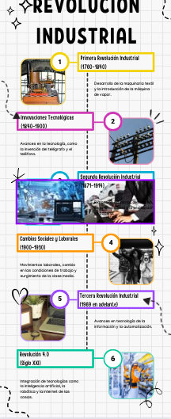

## Líneas temporales en Canva

### ¿Qué es una línea temporal

Una línea temporal es una representación gráfica que muestra la secuencia de eventos a lo largo del tiempo. Puede presentarse de manera lineal o de otra forma visual, pero su propósito principal es ilustrar la cronología de eventos de manera clara y ordenada. Las líneas de tiempo pueden ser utilizadas en diversos contextos, y en educación, desempeñan un papel fundamental debido a su capacidad para organizar información histórica, científica o cualquier otra temática que involucre una secuencia temporal.

**Utilidades de una línea temporal en educación:**

1. **Organización de Eventos Históricos:**
   - Facilita la comprensión de la secuencia temporal de eventos históricos, permitiendo a los estudiantes visualizar y relacionar causas y efectos.

2. **Contextualización de Contenidos Literarios:**
   - Ayuda a los estudiantes a comprender la secuencia de eventos en obras literarias, situándolos en un contexto histórico o narrativo.

3. **Representación de Procesos Científicos:**
   - En ciencias, las líneas de tiempo pueden utilizarse para mostrar el desarrollo de teorías, descubrimientos científicos y procesos evolutivos.

4. **Seguimiento de Proyectos y Tareas:**
   - En entornos educativos, las líneas de tiempo también pueden utilizarse para planificar y realizar un seguimiento de proyectos, tareas o actividades a lo largo del tiempo.

5. **Exploración de Biografías:**
   - Permite visualizar la vida de una persona a lo largo del tiempo, resaltando eventos clave en su biografía.

6. **Comprensión de Desarrollos Tecnológicos:**
   - Muestra la evolución y cronología de inventos y desarrollos tecnológicos, ayudando a los estudiantes a comprender cómo la tecnología ha avanzado con el tiempo.

7. **Estudio de la Evolución:**
   - En biología, una línea temporal puede utilizarse para representar la evolución de especies y acontecimientos biológicos significativos.

8. **Visualización de Procesos Geológicos:**
   - En geología, las líneas de tiempo pueden utilizarse para mostrar la secuencia de eventos geológicos, como la formación de capas rocosas o cambios en el clima.

9. **Análisis de Movimientos Sociales:**
   - Facilita el análisis de movimientos sociales, políticos o culturales, permitiendo a los estudiantes comprender la evolución de ideologías y eventos importantes.

10. **Preparación para Evaluaciones:**
    - Ayuda a los estudiantes a revisar y organizar información antes de exámenes o evaluaciones al proporcionar una representación visual de los conceptos clave y su relación temporal.

En resumen, las líneas de tiempo son herramientas valiosas en educación porque ayudan a los estudiantes a organizar, comprender y recordar información cronológica de manera más efectiva. Además, fomentan habilidades de análisis, síntesis y contextualización.

[Vídeo: Líneas temporales](https://drive.google.com/file/d/1I6Zwnw0C7yEWJkRc0lPr-LQExc61l82i/view?usp=sharing)

### Ejemplos de líneas temporales con Canva

A continuación, te proporcionaré un ejemplo de contenido que podrías utilizar para crear una línea temporal educativa con Canva. Puedes seguir estos pasos y personalizarlos según el tema específico que estés abordando.

**Título:**
- **Tema:** "Historia de la Revolución Industrial"

**Fecha de Inicio:**
- **Fecha Inicial:** 1760

**Evento 1: Primera Revolución Industrial (1760-1840)**
- **Descripción:** Desarrollo de la maquinaria textil y la introducción de la máquina de vapor.
- **Imagen:** Representación visual de fábricas y maquinaria.

**Evento 2: Innovaciones Tecnológicas (1840-1900)**
- **Descripción:** Avances en la tecnología, como la invención del telégrafo y el teléfono.
- **Imagen:** Ilustraciones de dispositivos tecnológicos de la época.

**Evento 3: Segunda Revolución Industrial (1871-1914)**
- **Descripción:** Expansión industrial, desarrollo de la electricidad y la producción en cadena.
- **Imagen:** Representación de fábricas modernas y líneas de montaje.

**Evento 4: Cambios Sociales y Laborales (1900-1930)**
- **Descripción:** Movimientos laborales, cambio en las condiciones de trabajo y surgimiento de la clase media.
- **Imagen:** Fotografías de huelgas y manifestaciones.

**Evento 5: Tercera Revolución Industrial (1969 en adelante)**
- **Descripción:** Avances en tecnología de la información y la automatización.
- **Imagen:** Representación de computadoras y tecnología moderna.

**Evento 6: Revolución 4.0 (Siglo XXI)**
- **Descripción:** Integración de tecnologías como la inteligencia artificial, la robótica y la internet de las cosas.
- **Imagen:** Gráficos que representan la conexión global a través de la tecnología.

**Fecha de Conclusión:**
- **Fecha Final:** Presente

**Colores:**
- Utiliza colores que reflejen la época y la evolución, como tonos sepia para los eventos históricos y colores más modernos para los eventos actuales.

**Estilo:**
- Mantén un diseño claro y organizado para facilitar la lectura y comprensión.
- Utiliza fuentes legibles.

Recuerda que Canva te ofrece una amplia gama de herramientas para personalizar el diseño, como iconos, imágenes, líneas y texto. Aprovecha estas opciones para hacer tu línea temporal educativa más visualmente atractiva y significativa.

[Vídeo: ejemplo de línea temporal](https://drive.google.com/file/d/1hBdPce4lpPVsrPNrUiQD9gwMPJNzMIK4/view?usp=sharing)

[Canva sobre - Línea temporal sobre la revolución industrial](https://www.canva.com/design/DAF6Kciu2U8/wsMjVlWekDKcqPjEDAbfYg/view?utm_content=DAF6Kciu2U8&utm_campaign=designshare&utm_medium=link&utm_source=editor)

Hemos visto en el vídeo:

* Una línea temporal es una infografía donde situamos visualmente determinados acontecimientos.
* Hay muchos formatos: lineales, en zig-zag, extensos, gráficos,...
* En una línea temporal no conviene incluir mucho texto
* Menos es más
* Imágenes que aporten
* Las fechas no son esenciales, mejor recordar el orden
* Se pueden usar para esquematizar procesos o proyectos

