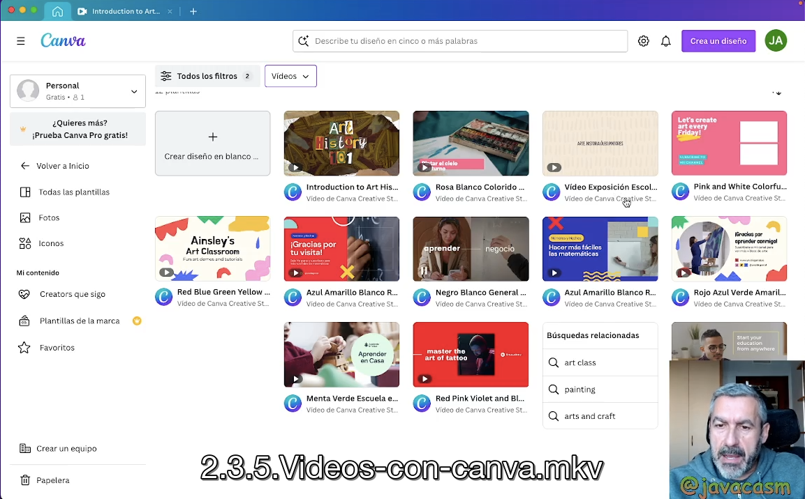
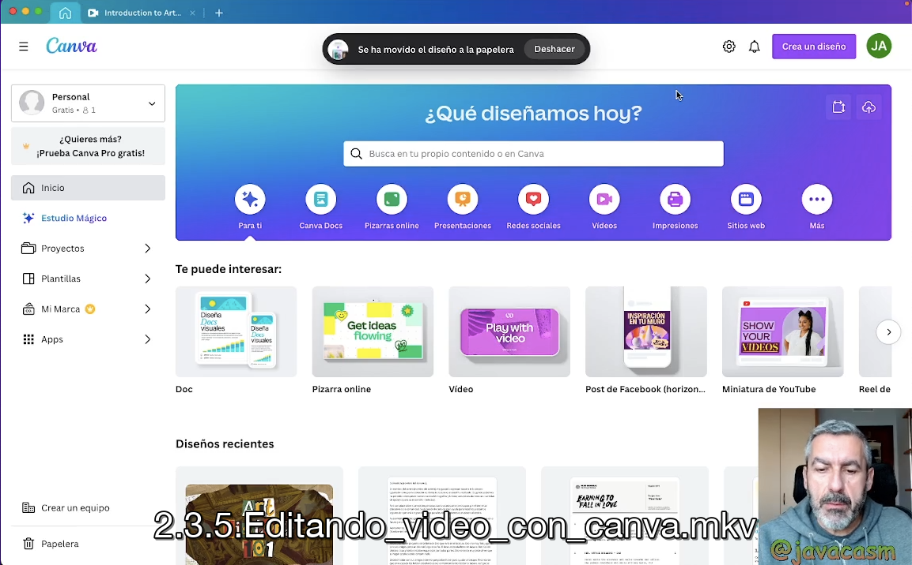
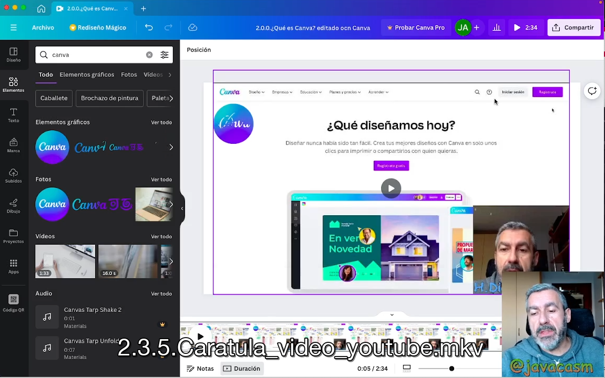
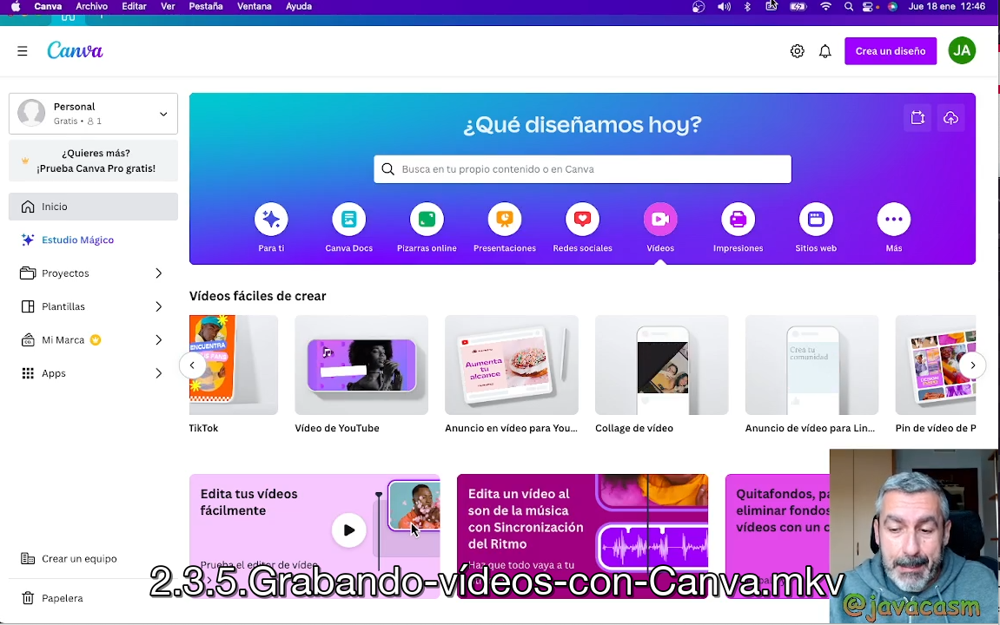

## Vídeos con Canva

Podemos genera vídeos con Canva casi desde cualquier formato, grabando nuestro audio, o nuestra webcam, mientras narramos una presentación o generando vídeos a partir de diferentes fuentes, como podemos ver en [este ejemplo de vídeo creado con Canva](https://www.canva.com/templates/EAFpgG5Zz7Y-introduction-to-art-history-educational-video-in-brown-dark-brown-green-collage-photographic-style/)

Veamos en más detalle las posibilidades de Canva para generar vídeos

[Trabajando vídeo con Canva](https://drive.google.com/file/d/1JL_9DtUsPKW6TRJI4NjG_UG4r4TDs4_P/view?usp=sharing)

En cualquier de ellos podemos definir el formato de vídeo que vamos a realizar, según el destino de este (no es igual un vídeo para youtube que para instagram o TikTok)

### Edición de vídeo con Canva

También podemos editarlos, usando un sencillo pero potente editor de vídeo online

[Vídeo sobre edición de "vídeo" con Canva](https://drive.google.com/file/d/18l-LAKcFYfV0wRN3i3449qMDd-CVwqzY/view?usp=sharing)

### Creación de otros materiales relacionados con vídeo

Canva también nos permite realizar material relacionado con vídeos como puede ser carátulas, breves presentaciones,...

[Vídeo sobre cómo crear una carátula para youtube con Canva](https://drive.google.com/file/d/1raB4UOjieBTKw7JKLZl5RYFIJg9ucWCr/view?usp=sharing)

### Grabación de vídeos con Canva

Como ya hemos dicho también podemos grabar vídeos con Canva mientras narramos una presentación o comentamos nuestro material.

Podemos usar nuestra webcam y además grabar nuestro audio.

[Grabando vídeos con Canva](https://drive.google.com/file/d/1_bWVVv31VNv2yLbfdK1zGe-xn2fmVEe7/view?usp=sharing)

