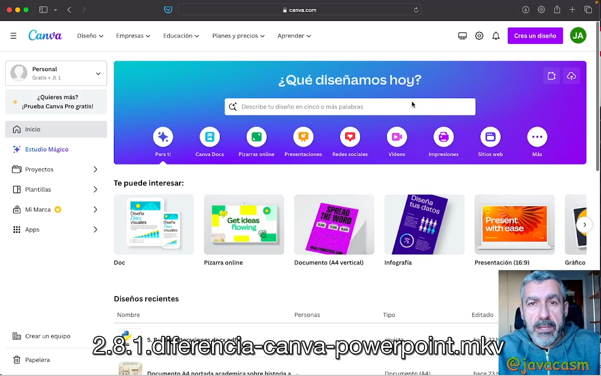

## Diferencia entre Canva y Power Point

Canva y PowerPoint son dos herramientas que se utilizan para crear presentaciones y otros tipos de material visual, pero difieren en varios aspectos, incluyendo su enfoque, funcionalidades y la forma en que los usuarios interactúan con ellos.

### Canva:

1. **Enfoque en el Diseño Gráfico:**
   - Canva se destaca por su enfoque en el diseño gráfico y la creación de contenido visualmente atractivo. Proporciona una amplia variedad de plantillas y herramientas para diseñar infografías, pósters, redes sociales, presentaciones, entre otros.

2. **Plantillas Prediseñadas:**
   - Ofrece una amplia gama de plantillas prediseñadas que facilitan a los usuarios la creación de contenido visual de manera rápida y sencilla.

3. **Acceso a Recursos Gráficos:**
   - Canva proporciona una biblioteca extensa de imágenes, iconos, fuentes y otros elementos gráficos que los usuarios pueden utilizar en sus diseños.

4. **Interfaz Intuitiva y Drag-and-Drop:**
   - Su interfaz es intuitiva y fácil de usar, permitiendo a los usuarios arrastrar y soltar elementos en sus diseños.

5. **Enfoque en la Colaboración:**
   - Canva facilita la colaboración en tiempo real, permitiendo que varias personas trabajen en el mismo diseño simultáneamente.

6. **Acceso Gratuito y Modelo de Pago por Recursos Premium:**
   - Canva ofrece una versión gratuita con funcionalidades básicas y una opción de suscripción premium (Canva Pro) que brinda acceso a más funciones y recursos.

### PowerPoint:

1. **Enfoque en Presentaciones y Slides:**
   - PowerPoint es una aplicación de software desarrollada por Microsoft y está específicamente diseñada para la creación de presentaciones y diapositivas.

2. **Flexibilidad en Contenidos y Datos:**
   - PowerPoint es versátil y permite la creación de presentaciones que incluyen texto, imágenes, gráficos, tablas, y más. También es comúnmente utilizado para presentaciones empresariales y académicas.

3. **Uso Común en Entornos Empresariales:**
   - PowerPoint es una herramienta estándar en muchos entornos empresariales y académicos, y su formato de archivo (.ppt o .pptx) es ampliamente reconocido.

4. **Funciones Avanzadas para Animaciones y Transiciones:**
   - PowerPoint ofrece funciones más avanzadas para animaciones, transiciones y control de diapositivas, lo que puede ser especialmente útil para presentaciones más dinámicas.

5. **Integración con Otros Productos de Microsoft:**
   - PowerPoint se integra bien con otros productos de Microsoft, lo que facilita la creación y edición de presentaciones en colaboración con otros usuarios.

6. **Licencia de Software:**
   - PowerPoint generalmente se instala como parte del paquete de software de Microsoft Office y requiere una licencia para su uso.

### Resumen:

- **Canva:** Se centra en el diseño gráfico con plantillas prediseñadas y una interfaz intuitiva, y es especialmente útil para crear contenido visualmente atractivo.
  
- **PowerPoint:** Es una herramienta de presentación más tradicional, versátil y enfocada en slides, comúnmente utilizada en entornos empresariales y académicos.

La elección entre Canva y PowerPoint depende de las necesidades específicas del usuario y el tipo de contenido visual que estén buscando crear. Muchos usuarios encuentran útil utilizar ambas herramientas según el contexto y los requisitos del proyecto.

[Vídeo: diferencias entre PowerPoint y Canva](https://drive.google.com/file/d/1G_8DE4qkEs7eIZCgRCu-HdadmMJuNH9Z/view?usp=sharing)

En este vídeo hemos visto:

* PowerPoint tiene un mercado más corporativo, más profesional.
* PowerPoint es muy pontento, pero Canva es más sencillo de usar y sus plantillas son más vistosas
* Podemos importar un fichero PowerPoint a Canva, arrastrándolo.
* Canva está pensado para ser más gráfico, más alegre, visual y divertido. 
* Su interface está pensado para encontrar un diseño que nos guste y modificarlo.
