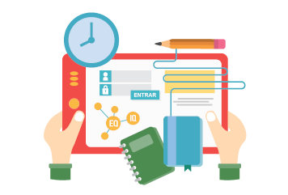

## Creando contenidos educativos interactivos

Utilizar contenidos interactivos en educación potencia el desarrollo de habilidades clave en los estudiantes, lo que se alinea perfectamente con el enfoque de competencias en la enseñanza y el aprendizaje. Aquí hay algunas razones desde esta perspectiva:

1. **Desarrollo de habilidades de pensamiento crítico y resolución de problemas:** Los contenidos interactivos desafían a los estudiantes a pensar de manera crítica y a encontrar soluciones a problemas planteados, lo que fomenta el desarrollo de habilidades de análisis y resolución de problemas.

2. **Fomento de la colaboración y la comunicación:** Muchos contenidos interactivos promueven la colaboración entre los estudiantes, ya sea a través de actividades en grupo o de herramientas de comunicación integradas, lo que les permite practicar habilidades de comunicación efectiva y trabajo en equipo.

3. **Desarrollo de competencias digitales:** Al utilizar contenidos interactivos, los estudiantes se familiarizan con diversas herramientas y tecnologías digitales, lo que les ayuda a desarrollar habilidades digitales fundamentales que son esenciales en el mundo actual.

4. **Promoción de la autonomía y la autorregulación:** Los contenidos interactivos a menudo permiten que los estudiantes avancen a su propio ritmo y tomen decisiones sobre su proceso de aprendizaje, lo que fomenta la autonomía y la autorregulación, competencias clave para el aprendizaje a lo largo de la vida.

5. **Desarrollo de habilidades de investigación:** Muchos contenidos interactivos requieren que los estudiantes busquen información, evalúen fuentes y sinteticen conocimientos, lo que contribuye al desarrollo de habilidades de investigación y alfabetización informativa.

6. **Promoción de la creatividad y la innovación:** Los contenidos interactivos ofrecen un entorno en el que los estudiantes pueden experimentar, crear y expresarse de manera creativa, lo que fomenta el desarrollo de habilidades de pensamiento lateral, innovación y creatividad.

7. **Facilitación del aprendizaje basado en proyectos:** Los contenidos interactivos pueden ser utilizados para apoyar el aprendizaje basado en proyectos, lo que permite a los estudiantes desarrollar habilidades de planificación, organización, trabajo en equipo y presentación mientras abordan problemas o temas relevantes.

En conclusión, los contenidos interactivos en educación son una herramienta valiosa para el desarrollo de competencias clave en los estudiantes, ya que ofrecen oportunidades para practicar y aplicar habilidades en un entorno de aprendizaje dinámico y estimulante.