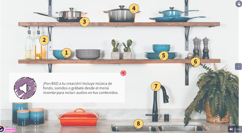
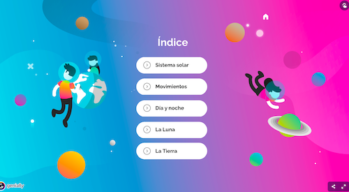

### Ejemplos de imagen interactiva 

Veamos este [ejemplo de imagen interactiva](https://view.genial.ly/65b1651b59ea3e0014f1eef8/interactive-image-imagen-interactiva-audios) y cómo está implementado en Genially

[Vídeo sobre imagen interactiva](https://drive.google.com/file/d/1Iw711h9qLZHATZY6h6nM2HOVM5UEyrrg/view?usp=drivesdk)

En este vídeo hemos visto:

* Uno de los tipos más interesante de opciones dentro de las creaciones Genially, puede ser la “Imagen interactiva”. 
* Si seleccionamos sobre una de ellas podemos crearlas a partir de de un formato vertical, cuadrado o bien ver algunos ejemplos ya realizados.
* Al comenzar nuestro proyecto, debemos filtrar y seleccionar nuestro plan, Educación, Premium o Gratis, según lo que tengamos contratado para evitar problemas.
* Seleccionamos la plantilla “imagen interactiva audios” gratuíta. 
* Pulsamos “Usar esta Plantilla” y la tenemos disponible para trabajar con ella. 
* Nos muestra y resalta los puntos interactivos 
* Tocando sobre los elementos, veremos asociado el icono de animación:

 
   - Las animaciones que tienen cada uno de ellos a la entrada, continuo o a la salida. Como un efecto zoom, bote, rotación, rodar…

* Si pulsamos sobre el icono de interacción

   - Veremos las interacciones que tiene activadas, pueden ser más de una, como Etiqueta, Ventana, Enlace, Audio, Ampliar y Mostrar

* Para ver el resultado podemos usar la opción "Previsualizar" o la de presentar:

* Recuerda que muchas plantillas de Genially incluye una colección de recursos gráficos al final

### Ejemplo sistema solar

Veamos ahora  un ejemplo de [presentación sobre el Sistema Solar](https://view.genial.ly/5dc793d0fd67900fa17458c3/guide-lpsistema-solar)

[Vídeo presentación sobre el Sistema Solar](https://drive.google.com/file/d/1O92KlIKHkz7Sgjgr3yaqPcBPofvJon8C/view?usp=drivesdk)

En este vídeo hemos visto:

* Al inicio, nos encontramos con un menú que nos va a ir distribuyendo entre las diferentes opciones o elementos interactivos con botones interiores o exteriores en los que se nos muestran bien resaltados
* Varios puntos de interés que nos proporcionan distintos tipos de información. 
* Cuando hagamos nuestra presentación es importante que quede claro, en qué lugar se debe pulsar para hacerla más efectiva.
* Vamos a ver cómo está estructurado:

   - El Sistema Solar, está representado con una imagen formada por diferentes planetas  y si vamos tocando cada uno de ellos, al tocarlos nos aparece una “etiqueta” con una foto o imagen y una breve descripción de sus características
   - Movimientos, una presentación en la que nos van explicando cómo se va produciendo el movimiento o tipo de  rotación. 
   - También podemos observar las distintas Estaciones del año y mediante una “etiqueta” con fotos y texto, nos va explicando que, dependiendo de la inclinación y de la posición de la Tierra, el Sol incide de manera diferente y en diferentes lugares en cada estación.
   - Día y noche, mediante un gif o animación, nos presenta el efecto que produce la rotación de la Tierra con la luz del Sol. Nos ofrece la opción de realizar un sencillo experimento pulsando en el botón de ”“Prueba”
   - La Luna
   - La Tierra

* En la presentación podemos ver un montón de elementos que podremos ir utilizando. 
* La ventaja es que nos va a enseñar cómo podemos ir buscando diferentes recursos que aplicar directamente a nuestro proyecto. 
* Es elaborada pero sencilla, y en cada uno de los elementos, vamos añadiendo un punto de interés y asociado a éste, cierto contenido.
* La mayoría de los recursos son etiquetas.
* Podemos también, extender el contenido de la información que nos muestra mediante enlaces externos y actividades.
* Recordad que debemos tener presente siempre que las imágenes o fotografías que usamos en nuestros proyectos, deben ir acompañadas de las Licencias o la fuente de procedencia de las mismas.

