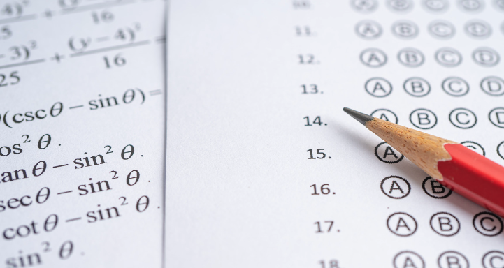

## Herramientas de evaluación, Cuestionarios

Evaluar las competencias en el contexto educativo implica utilizar una variedad de enfoques y herramientas que permitan medir el grado en que los estudiantes han adquirido y pueden aplicar habilidades específicas. Aquí hay algunas estrategias y métodos comunes para evaluar las competencias:

1. **Rubricas de evaluación**: Desarrollar rubricas claras y específicas que describan los criterios de desempeño para cada competencia. Las rubricas proporcionan un marco transparente para evaluar el desempeño de los estudiantes y permiten una evaluación más objetiva y consistente.

2. **Portafolios**: Los portafolios permiten a los estudiantes recopilar y organizar muestras de su trabajo que demuestren el desarrollo de competencias a lo largo del tiempo. Los estudiantes pueden incluir proyectos, ensayos, presentaciones y otras evidencias de su aprendizaje.

3. **Evaluaciones basadas en proyectos**: Asignar proyectos auténticos que requieran que los estudiantes apliquen múltiples competencias en situaciones del mundo real. Evaluar el proceso de diseño, planificación, ejecución y presentación del proyecto, así como los resultados finales.

4. **Evaluaciones por pares y autoevaluaciones**: Incorporar la retroalimentación de los compañeros y la autoevaluación en el proceso de evaluación. Los estudiantes pueden evaluar el trabajo de sus compañeros utilizando las mismas rubricas utilizadas por el profesor, lo que fomenta la reflexión y el aprendizaje entre pares.

5. **Simulaciones y escenarios**: Utilizar simulaciones y escenarios de la vida real para evaluar la capacidad de los estudiantes para aplicar competencias en situaciones prácticas. Esto puede incluir estudios de casos, juegos de roles y actividades de resolución de problemas.

6. **Observaciones en el aula**: Observar el desempeño de los estudiantes en el aula durante actividades grupales, discusiones y ejercicios prácticos. Esto proporciona información valiosa sobre cómo los estudiantes interactúan, colaboran y aplican competencias en tiempo real.

7. **Entrevistas y presentaciones orales**: Realizar entrevistas individuales o grupales y solicitar presentaciones orales donde los estudiantes puedan demostrar su comprensión y habilidades comunicativas. Evaluar la claridad, coherencia y efectividad de sus respuestas.

8. **Pruebas de rendimiento**: Diseñar pruebas específicas que evalúen el dominio de conocimientos y habilidades relacionadas con competencias específicas. Estas pruebas pueden incluir preguntas abiertas, problemas prácticos o escenarios de caso.

Al combinar diferentes enfoques y herramientas de evaluación, los educadores pueden obtener una comprensión más completa del desarrollo de competencias de los estudiantes y proporcionar retroalimentación significativa para su crecimiento continuo. Es importante adaptar las estrategias de evaluación a las necesidades y contextos específicos de los estudiantes y del currículo.

En este módulo vamos a ver varias herramientas que nos permiten evaluar el progreso del alumnado, al mismo tiempo que hacen este proceso divertido y atractivo.

Algunas de estas herramientas se pueden usar también para reforzar el aprendizaje.
