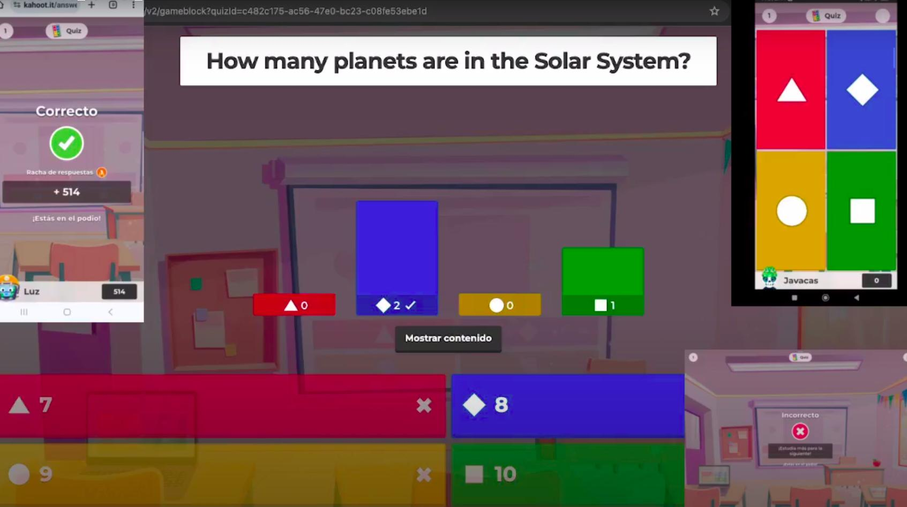

## Jugando con Kahoot

Antes de seguir avanzando vamos a intentar reproducir una típica sesión de Kahoot, donde varios participantes se conectan a un juego (Kahoot) que ya está en marcha

[Vídeo de un juego con Kahoot](https://drive.google.com/file/d/1Xb7slnXmw0e6y5ouOfbS9uhxSpJkjsmR/view?usp=drive_link)

En este vídeo hemos visto:

* Vamos a comenzar un Kahoot desde nuestro PC.
* Elegimos si lanzarlo desde nuestra cuenta o como invitado, sin usuario
* Se irá conectando a los dispositivos e iremos viendo su funcionamiento.
* Elegimos un Kahoot sobre el Sistema Solar.
* Iniciamos sesión en nuestra Cuenta o nos Registramos para guardar los resultados después del juego o Jugar como invitado sin acceso a los resultados. 
* Seleccionamos que ya tenemos Cuenta e introduciré usuario y contraseña e Iniciamos Sesión.
* Una vez que accedemos nos va a permitir que los participantes se vayan conectando.
Primero tenemos que lanzarlo desde nuestra cuenta, tarda un poco en  cargarse y cuando lo haga, nos aparecerá un código numérico que tenemos que comunicar a todos los participantes para introducirlo en los dispositivos, 
* Vamos a usar la aplicación Kahoot en varios dispositivos y también desde una página web.
* Nos pregunta si vamos a seleccionar  el Modo Clásico o Modo Equipo, ambos gratuitos.
* La opción de uso de los modos de pago, está disponible por un número de veces limitado.
* Vamos a comenzar con el modo clásico que nos permite hasta 40 jugadores (en la licencia gratuita), presentación interactiva y evaluación.
* Los jugadores se enfrentan y compiten por el primer puesto y los que contesten más rápido y obtengan más respuestas correctas, obtendrán las puntuaciones más altas.
* Estamos en la clase y nos va a aparecer en la pantalla “Prepárate para Unirte” Únete en www.kahoot.is o con la app de Kahoot!
* Esperamos que se cargue el PIN numérico de juego o la opción de utilizar el código QR, cuando aparezca los participantes podrán entrar.
* Cada participante tiene que introducirlo en su dispositivo una vez hayan accedido a la aplicación kahoot, tendrán que usar un nombre de usuario (Al lanzarlo se puede configurar que los nombres se generen automáticamente)
* Vamos a esperar que se conecten los distintos participantes y tenemos la opción de bloquear el acceso al juego para evitar que se unan más jugadores.
* Cuando se conectan los usuarios se les avisa de que se han unido y empezamos cuando todos estén conectados.
* Cuando comencemos, las preguntas serán visibles en todos los dispositivos y jugadores
* Aparece la pregunta e inmediatamente un contador, controla el tiempo de respuesta, por lo que las contestaciones han de ser rápidas. 
* A medida que se van resolviendo, vamos teniendo los resultados de cada jugador y el ranking se va actualizando según va avanzando el juego.
