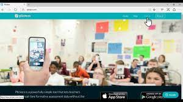

# INICIACIÓN A LAS HERRAMIENTAS DIGITALESEN EL AULA

## CEP de Motril

Enero de 2024

### José Antonio Vacas @javacasm

## Objetivos

- Mejorar la competencia digital docente del profesorado, proporcionándoles un kit de herramientas digitales muy diversas con distintas funcionalidades, útiles para el ámbito educativo.
- Dotar al profesorado de herramientas digitales funcionales tanto para el proceso de enseñanza-aprendizaje a distancia como presencial usando las TACs.
- Evaluar de forma eficaz usando plataformas digitales.
- Conocer y profundizar en algunas herramientas y recursos propuestos para la creación de contenido educativo con aplicación real en el aula.
- Propiciar la interacción y capacitación de los docentes generando debates, aportaciones y materiales entre los participantes a través de las experiencias personales y el diseño o creación de actuaciones educativas innovadoras.

## Contenidos

* Introducción
* Recursos
    * [Licencias](Licencias.md)
    * Recursos [sonoros](BancosSonidosMusica.md) y 
    * Recursos [visuales](https://aonialearning.com/herramientas/recursos-digitales-aula-online/)
    * [Generador de QR](https://es.qr-code-generator.com/)
    * [Bitmoji](https://www.bitmoji.com/)
    * [Google Expeditions](https://artsandculture.google.com/project/expeditions)
    
    * [Wikimedia](https://commons.wikimedia.org/wiki/Main_Page)

* Presentaciones:
    * [Canva](https://www.canva.com/es_es/)
    
    * [Genially](https://genial.ly) [Tutorial](https://www.educaciontrespuntocero.com/recursos/tutorial-crear-un-kahoot-para-clase/)
    * Crea comics con [pixton](https://edu-es.pixton.com/solo/) [Tutorial](https://www.educatorstechnology.com/2012/01/pixton-great-cartoon-and-comic-strip.html)
    
    * [Padlet](https://padlet.com/dashboard/gallery/all)
    * [HP5](https://h5p.org/)
    * [Miro](https://miro.com/app/#) Líneas temporales

* Tests/Juegos
    * [Kahoot](https://kahoot.it/)
    
    * [Plickers](https://get.plickers.com/)
    
    * [Educaplay](https://es.educaplay.com/)
    
    * [liveworksheets](https://es.liveworksheets.com/) para añadir interacción a nuestras presentaciones de Canva
    * [quizizz](https://quizizz.com/)

* Sonido y Podcast
    * Herramientas de grabación de sonido
    * [Edición de audio](edicionAudio.md)
    * Last.fm
    * iVoox

* Vídeo y su publicación
    * Grabación de vídeo [Android](GrabacionAndroid.md) y [iPad](GrabacionIPad.md)
    * Edición de vídeo
    * [Cap Cut](https://play.google.com/store/apps/details?id=com.lemon.lvoverseas&hl=es&gl=US)
    * [Kinemaster](https://play.google.com/store/apps/details?id=com.nexstreaming.app.kinemasterfree&hl=es_419&gl=US)
    * [Croma](./Croma.md)
    * Publicación: youtube y otros
